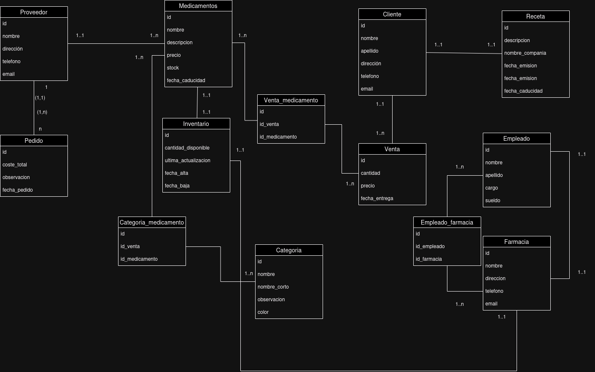

# Descipción

El proyecto representa el funcionamiento de una farmacia, simulando como sería este en la vida real, representando 10 modelos que se ven a continuación

<br>

# Esquema base de datos Entidad Relación



<br>

# Modelos

## Proveedor

Representa a los proveedores de medicamentos que surten la farmacia. Este modelo almacena la información de contacto de los proveedores, como su nombre, dirección, teléfono y correo electrónico.

```Python
nombre = models.CharField(max_length=100, verbose_name="Nombre del proveedor", help_text="Nombre completo del proveedor")
direccion = models.CharField(max_length=200)
telefono = models.CharField(max_length=15)
email = models.EmailField()
```

## Cliente

Almacena los datos de los clientes que realizan compras en la farmacia. Incluye elnombre, apellido, dirección, email, teléfono y si es frecuente o no (campo booleano).

```Python
nombre = models.CharField(max_length=100)
apellido = models.CharField(max_length=100)
direccion = models.CharField(max_length=200)
email = models.EmailField()
telefono = models.CharField(max_length=15)
frecuente = models.BooleanField(default=False)
```

## Medicamentos

Contiene los detalles de los medicamentos que vende la farmacia. Cada medicamento tiene un nombre, descripción, precio (con validación para que sea mayor a 0.01), stock, fecha de caducidad, y un proveedor (relación ForeignKey con el modelo Proveedor).

```Python
nombre = models.CharField(max_length=100, db_column="medicamento_nombre")
descripcion = models.TextField(db_comment="Descripción del medicamento", default="No hay descripción disponible")
precio = models.DecimalField(max_digits=10, decimal_places=2, validators=[MinValueValidator(0.01)], db_index=True)
stock = models.PositiveIntegerField()
fecha_caducidad = models.DateField()
proveedor = models.ForeignKey(Proveedor, on_delete=models.CASCADE, editable=False)
```

Representa las recetas médicas que los clientes presentan para comprar ciertos medicamentos. Cada receta está asociada a un cliente (relación OneToOne con el modelo Cliente), descripción de la receta, nombre de la compañía, fecha de emisión y fecha de caducidad.

## Receta
```Python
cliente = models.OneToOneField(Cliente, on_delete=models.CASCADE)
descripcion = models.TextField()
nombre_compania = models.CharField(max_length=100)
fecha_emision = models.DateField()
fecha_caducidad = models.DateField()
```

## Venta

Registra las ventas realizadas en la farmacia. Está vinculada a un cliente (relación ForeignKey con el modelo Cliente), medicamentos (relación ManyToMany con el modelo Medicamento), fecha de entrega (automáticamente asignada), cantidad de medicamentos vendidos, precio total, email de la farmacia y un recibo único.

```Python
cliente = models.ForeignKey(Cliente, on_delete=models.CASCADE)
medicamentos = models.ManyToManyField(Medicamento)
fecha_entrega = models.DateField(auto_now_add=True)
cantidad = models.PositiveIntegerField()
precio = models.DecimalField(max_digits=10, decimal_places=2)
email_farmacia = models.EmailField(),
recibo = models.CharField(max_length=100, unique_for_date="fecha_venta", unique_for_month="fecha_venta", unique_for_year="fecha_venta")

```

## Empleado

Representa a los empleados que trabajan en la farmacia. Almacena el nombre, apellido, cargo y sueldo de cada empleado.

```Python
nombre = models.CharField(max_length=100)
apellido = models.CharField(max_length=100)
cargo = models.CharField(max_length=50)
sueldo = models.DecimalField(max_digits=10, decimal_places=2)
```

## Farmacia

Almacena los datos de la farmacia en sí, incluyendo su nombre, dirección, teléfono, email, sitio web, propietario (relación OneToOne con el modelo Empleado) y una lista de empleados (relación ManyToMany con el modelo Empleado).

```Python
nombre = models.CharField(max_length=100)
direccion = models.CharField(max_length=200)
telefono = models.CharField(max_length=15)
email = models.EmailField()
url_web = models.URLField()
propietario = models.OneToOneField(Empleado, on_delete=models.CASCADE)
empleados = models.ManyToManyField(Empleado, related_name='farmacias')
```


## Pedido

Registra los pedidos de medicamentos que la farmacia hace a los proveedores. Cada pedido está vinculado a un proveedor (relación ForeignKey con Proveedor), coste total del pedido, observaciones, fecha del pedido y medicamentos incluidos en el pedido (relación ManyToMany con Medicamento).

```Python
proveedor = models.ForeignKey(Proveedor, on_delete=models.CASCADE)
coste_total = models.DecimalField(max_digits=10, decimal_places=2)
observacion = models.TextField()
fecha_pedido = models.DateField()
```

## Inventario

Controla el stock disponible de los medicamentos. Cada entrada en el inventario está vinculada a un medicamentos (relación ForeignKey con Medicamento), cantidad disponible, última actualización (automática), fecha de alta, fecha de baja (opcional) y la farmacia a la que pertenece (relación OneToOne con Farmacia).

```Python
medicamento = models.OneToOneField(Medicamento, on_delete=models.CASCADE)
cantidad_disponible = models.PositiveIntegerField()
ultima_actualizacion = models.DateTimeField(auto_now=True)
fecha_alta = models.DateField(auto_now_add=True)
fecha_baja = models.DateField(blank=True, null=True)
farmacia = models.OneToOneField(Farmacia, on_delete=models.CASCADE)
```

## Categoria

Clasifica los medicamentos en diferentes categorías para su organización dentro de la farmacia. Cada categoría tiene un nombre, lista de medicamentos (relación ManyToMany con Medicamento), nombre corto, observaciones y un color que represente la categoría.

```Python
nombre = models.CharField(max_length=50)
medicamentos = models.ManyToManyField(Medicamento, related_name='categorias')
nombre_corto = models.CharField(max_length=10)
observacion = models.TextField()
color = models.CharField(max_length=50)
```